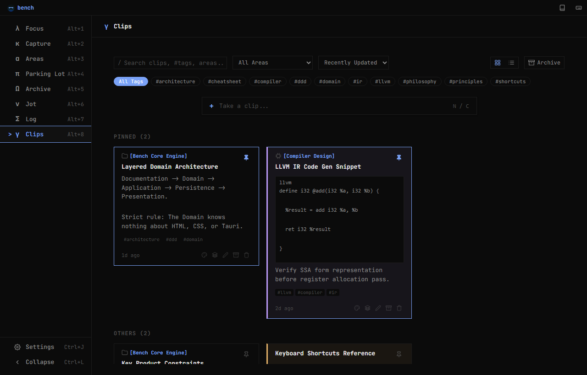
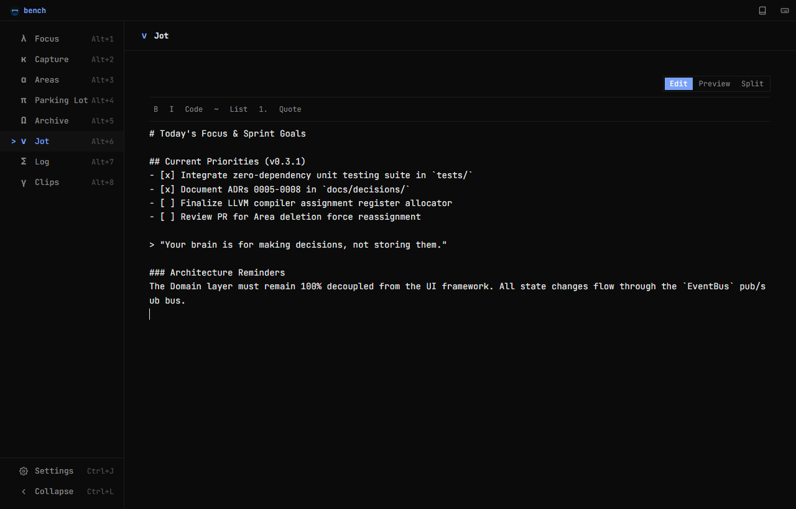
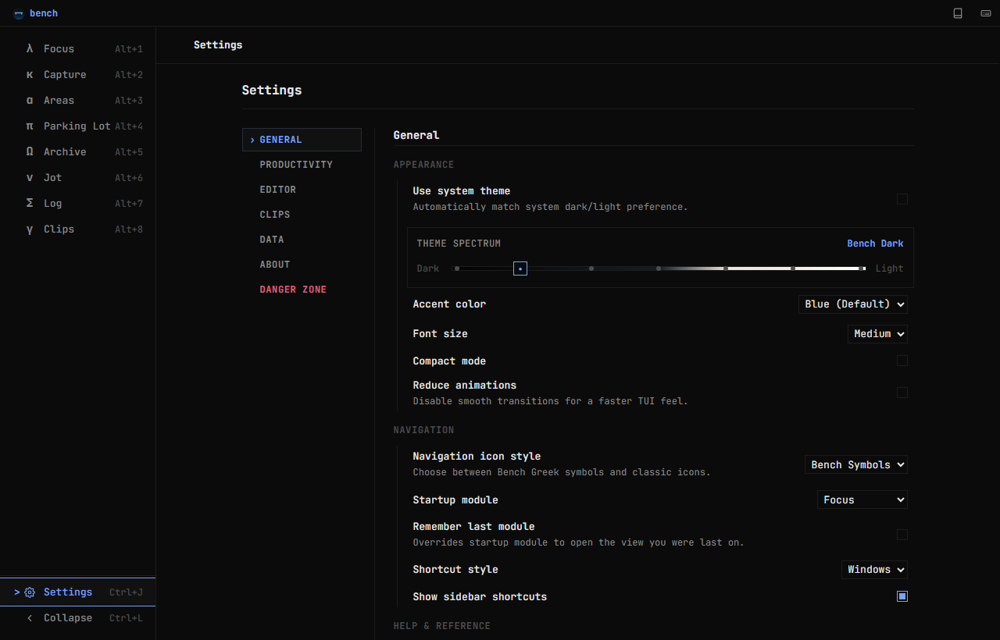

<div align="center">


# Bench

**Your brain is for making decisions, not storing them.**

[](https://github.com/sedmugen/bench/actions/workflows/ci.yml)
[](https://github.com/sedmugen/bench)
[](https://github.com/sedmugen/bench/releases)
[](./LICENSE)
[](https://github.com/sedmugen/bench)
[](https://tauri.app)

*A lightweight, local-first desktop command center built with Tauri v2, Rust, and Vanilla ES Modules.*

</div>

---

## Current Status

> **Bench is in early alpha.** Focus, Capture, Areas, Parking Lot, Archive, Jot, Clips, and Settings all work end-to-end and are used daily by the author — but expect rough edges, ongoing polish, and occasional breaking changes between releases until `v1.0.0`.
>
> If you are trying Bench out for the first time, treat it as a daily-driver experiment, not a finished commercial product yet.

---

## Visual Showcase

### Focus — The 3-Task Command Cockpit (`Alt+1`)
Enforces a hard limit of 3 active tasks to protect your cognitive bandwidth. When full, task creation collapses into a constraint boundary.


### Areas — Recursive Hierarchy & Workspace Inspector (`Alt+3`)
Organize long-term initiatives into multi-tier trees (`Academics > Compiler Design`) with acyclic cycle prevention and live task statistics.


### Clips — Visual Note Canvas & Color Tagging (`Alt+8`)
Color-coded reference cards featuring 15 Tokyo Night palette tints, normalized tag search, pinned cards, and responsive masonry layout.


### Jot — Markdown Scratchpad with Live Preview (`Alt+6`)
Instant, auto-saving markdown editor with typography controls, live preview, and quick drafting.


### Settings — Two-Pane Preferences & Theme Spectrum (`Ctrl+J` / `⌘J`)
Calibrated across 7 luminance levels (deep-dark to light) with configurable Greek symbol or Lucide iconography styles.


---

## Why Bench Exists

Modern productivity software has become increasingly complex.

More features. More dashboards. More notifications. More customization.

Yet the hardest question remains unanswered:

> **What should I be doing right now?**

Bench is designed to answer that question within five seconds.

It is intentionally opinionated.

It prefers clarity over flexibility, focus over features, and calmness over customization.

Bench is not trying to replace every productivity tool. It is trying to become the one application that stays open all day and quietly tells you what deserves your attention.

---

## Philosophy

Bench is founded on one belief:

> **Your brain is for making decisions, not storing them.**

- Ideas belong in **Capture**.
- Tasks belong in **Areas**.
- Areas belong inside **Bench**.
- Your attention belongs on your **work**.

### Why Another Productivity App?

Bench is not competing with Notion, Obsidian, Todoist, Trello, ClickUp, or Jira.

Those applications solve **organization**.

Bench solves **prioritization**.

Bench exists to reduce the mental effort required to decide what to do next.

---

## The Manifesto

- **Your brain is for thinking. Not remembering.**
- **Focus is finite.** If everything is important, nothing is. Bench intentionally embraces constraints.
- **Complexity is failure.** Every feature must justify its existence. If it increases cognitive load, it does not belong.
- **Local first.** Your information belongs to you. Bench remains 100% usable offline with zero remote telemetry.
- **Organize less. Do more.** Bench should disappear into your workflow rather than become another project to maintain.

---

## Core Values

- **Clarity:** Always know what deserves your attention right now.
- **Calm:** The interface should never compete with your thoughts.
- **Intentionality:** Everything in Bench exists for a reason.

---

## What Bench Is / What Bench Is Not

| What Bench Is | What Bench Is Not |
|---|---|
| A desktop command center | Notion or Obsidian |
| A strict focus prioritization system | Jira, ClickUp, or Trello |
| An Areas hierarchy companion | CRM or Project Management suite |
| Local-first & offline-first | Team collaboration software |
| Keyboard-first workflow | AI assistant or cloud sync engine |
| Opinionated by design | Calendar replacement |

> *Bench intentionally solves a smaller, sharper problem.*

---

## Product Principles

- **Simplicity** over flexibility
- **Clarity** over customization
- **Local** over cloud
- **Keyboard** over mouse
- **Opinionated** over configurable
- **Areas** over categories
- **Decisions** over organization

---

## Design Philosophy

- **Whitespace is a feature.**
- **Animations should be subtle and instant.**
- **Color should communicate, never decorate.**
- **The interface should feel like a quiet desk, not a busy dashboard.**

---

## Tech Stack

| Layer | Technology | Description |
|---|---|---|
| **Desktop Shell** | [Tauri v2](https://tauri.app/) · Rust 2021 | Native system host, window chrome management, and local binary builds |
| **Frontend Core** | Vanilla JavaScript (ES2022+) | Pure ES Modules, zero UI framework dependencies, zero runtime bundler |
| **Styling & Tokens** | Modern CSS3 | Custom Properties design system, CSS Grid, Tokyo Night dark aesthetic |
| **Persistence** | Local Storage JSON API | Isolated repository architecture with single-source-of-truth stores |
| **Testing** | Node.js Test Runner (`node:test`) | Native, zero-dependency unit test suite covering domain entities and stores |
| **Typography** | JetBrains Mono | Monospace typeface optimized for code glanceability |

---

## Architecture Overview

Bench adheres to **Documentation-Driven Development (DDD)** and a clean **Layered Domain Architecture**:

```
┌────────────────────────────────────────────────────────┐
│                      Presentation                      │
│   src/index.html · src/styles.css · src/theme/         │
│   src/modules/* (Views) · src/ui/* (Components/Modals) │
└───────────────────────────▲────────────────────────────┘
                            │ (DOM Events / Injected Resolvers)
┌───────────────────────────┴────────────────────────────┐
│                    Application Bridge                  │
│   src/main.js · src/core/shortcuts.js · EventBus       │
└───────────────────────────▲────────────────────────────┘
                            │ (Domain Events & Operations)
┌───────────────────────────┴────────────────────────────┐
│                   Domain & Persistence                 │
│   src/core/repository.js · src/core/clips-store.js     │
│   src/core/jot-store.js · src/core/settings-store.js   │
└───────────────────────────▲────────────────────────────┘
                            │ (Local Storage JSON Gateway)
┌───────────────────────────┴────────────────────────────┐
│                  Desktop & Host Shell                  │
│   src-tauri/ (Tauri v2, Rust) / scripts/dev-server.js   │
└────────────────────────────────────────────────────────┘
```

1. **Domain Isolation:** The core stores (`Repository`, `ClipsStore`, `JotStore`, `SettingsStore`) contain zero HTML/CSS/UI dependencies.
2. **Decoupled Pub/Sub:** An in-memory synchronous `EventBus` communicates state mutations across views without tight coupling.
3. **Derived State:** Active task counts, area hierarchies, focus membership, and completion metrics are computed dynamically on read and never redundantly persisted.

See [`docs/architecture.md`](./docs/architecture.md) for full architectural specifications.

---

## Installation & Setup

### Prerequisites
- **Node.js** (v18.0.0+ LTS)
- **Rust Toolchain** (via `rustup`)
- OS-specific [Tauri Prerequisites](https://tauri.app/start/prerequisites/)

### Clone & Install
```bash
git clone https://github.com/sedmugen/bench.git
cd bench
npm install
```

### Running Locally
```bash
# 1. Desktop Mode (Tauri with native window controls and hot reload)
npm run tauri dev

# 2. Web Browser Mode (Zero native dependencies, instant startup)
npm run dev:web
# -> Open http://localhost:3000
```

### Running Tests
```bash
npm test
```

### Release Build
```bash
npm run tauri build
```

See [`BUILD.md`](./BUILD.md) for detailed build and setup instructions.

---

## Usage & Keyboard Workflows

Bench is designed to be operated entirely from the keyboard:

### Global Navigation & Shell
| Shortcut | Action |
|---|---|
| `Ctrl+N` / `⌘N` / `C` | Quick Capture from anywhere |
| `Ctrl+B` / `⌘B` / `Ctrl+L` | Toggle Sidebar Collapse |
| `Ctrl+J` / `⌘J` | Open Settings |
| `Alt+1` … `Alt+8` | Jump directly to Focus, Capture, Areas, Parking Lot, Archive, Jot, Log, Clips |
| `Escape` | Close active modal / dismiss Inspector / clear selection |

### List Navigation & Task Actions
| Shortcut | Action |
|---|---|
| `↑` / `↓` | Navigate item selection |
| `Enter` / `E` | Open Inspector / edit item inline |
| `Space` | Toggle task completion |
| `F` | Promote selected task to Focus (respects 3-task limit) |
| `P` | Defer selected task to Parking Lot |
| `A` | Move selected task to Archive |
| `Delete` / `D` | Delete item (triggers instant Undo toast in Focus) |

See [`docs/usage.md`](./docs/usage.md) for complete daily prioritization workflows.

---

## The Definition of Success

Bench succeeds if opening the application answers one question within five seconds:

> **What should I be doing right now?**

If Bench ever requires more effort to maintain than the clarity it provides, Bench has failed.

---

## Roadmap & Milestones

- [x] **v0.1.0 — Workbench**: Core Tauri desktop shell, Focus 3-task engine, Capture, Parking Lot, Archive, local JSON persistence.
- [x] **v0.2.0 — Sharpen**: Jot markdown scratchpad, Settings suite, keyboard navigation, multi-theme engine.
- [x] **v0.3.0 — Craft**: Multi-tier Areas hierarchy, Log activity journal, two-pane Settings, dual web runtime.
- [x] **v0.3.1 — Polish**: Clips visual notes module, masonry layout, 15-color palette, automated test suite, CI workflows.
- [ ] **v1.0.0 — Built**: Cross-platform binary releases, accessibility auditing, SQLite storage driver.

See [`ROADMAP.md`](./ROADMAP.md) for detailed milestone breakdowns.

---

## License & Credits

- **License:** Distributed under the [MIT License](./LICENSE).
- **Author:** Saad Mughal ([@sedmugen](https://github.com/sedmugen))
- **Documentation:** Engineering guidelines and architectural records are located in [`docs/INDEX.md`](./docs/INDEX.md).

---

<div align="center">

**Build less. Focus more. Keep the bench clean.**

</div>
