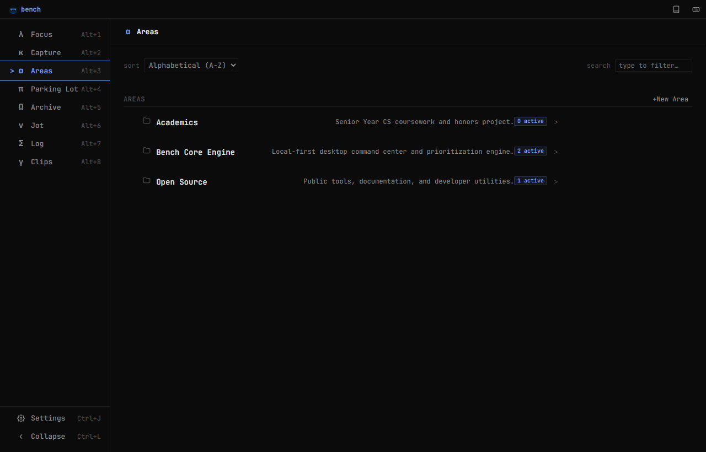
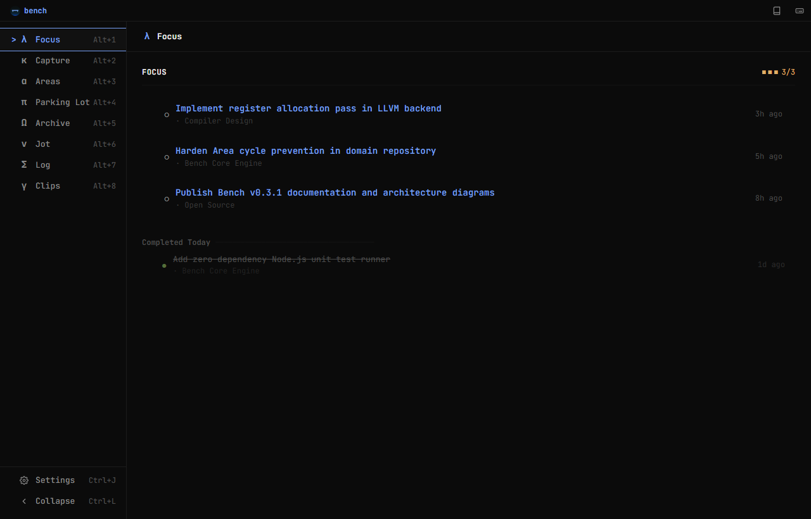

# Bench

> **Your brain is for making decisions, not storing them.**

[](https://github.com/sedmugen/bench/actions/workflows/ci.yml)


A lightweight, local-first, keyboard-first desktop command center and prioritization engine built with Tauri v2, Rust, and Vanilla ES Modules.

---

## Visuals & Interface

### Focus — The 3-Task Command Cockpit


### Areas — Hierarchical Responsibility Workspace


### Command Palette — Instant Keyboard Navigation & Search


---

## Overview & Motivation

Modern productivity software has become excessively complicated. Tools like Notion, Jira, ClickUp, and Obsidian encourage users to build elaborate systems of tags, databases, dashboards, and automated workflows. The productivity system itself becomes the work.

Yet the most critical question of your workday remains unanswered:

> **"What should I be doing right now?"**

Bench is designed to answer that question within five seconds.

Bench solves **prioritization**, not organization. It is intentionally constrained:
- **Focus is Finite:** A hard cap of **3 active Focus tasks** forces deliberate prioritization.
- **Glanceable & Calm:** Monospace typography, zero noisy notifications, zero distraction animations, and a dark terminal aesthetic.
- **Local-First & Private:** Your data remains 100% on your device in local persistence with zero accounts or telemetry.
- **Keyboard-First:** Every triage action, navigation route, note creation, and search query is executable without touching the mouse.

---

## Features

- **λ Focus Module (`Alt+1`)**: The 3-task active priority queue with inline editing, drag-and-drop reordering, Area tagging, and completion tracking.
- **κ Capture Module (`Alt+2`)**: Frictionless inbox for rapid thought capture with single-key triage to Focus, Parking Lot, or Archive.
- **α Areas Module (`Alt+3`)**: Recursive multi-tier initiative hierarchy with cycle detection, task reassignment, and live aggregated progress stats.
- **π Parking Lot Module (`Alt+4`)**: Dedicated incubator for deferred tasks that matter, just not today.
- **Ω Archive Module (`Alt+5`)**: Permanent audit trail of finished milestones and discarded thoughts with restore capabilities.
- **ν Jot Module (`Alt+6`)**: Instant markdown scratchpad with live preview and auto-saving.
- **Σ Log Module (`Alt+7`)**: Completion activity journal and calendar history view.
- **γ Clips Module (`Alt+8`)**: Visual card canvas with 15-color palette tagging, normalized tag search, pinned cards, and responsive masonry layout.
- **⌘K Command Palette**: Global fuzzy finder for instant module switching, entity lookup, and command execution.
- **Inspector Drawer**: Resizable contextual panel for in-depth task notes and Area workspace management.
- **Dual Desktop / Web Engine**: Native desktop integration via Tauri v2 plus a zero-dependency web browser development server.
- **Theme & Symbol Customization**: 7 luminance levels (deep dark to light) and configurable iconography (Greek Bench Symbols vs. Classic Lucide icons).

---

## Tech Stack

| Layer | Technology | Description |
|---|---|---|
| **Desktop Shell** | [Tauri v2](https://tauri.app/) · Rust 2021 | Native system host, window chrome management, and local binary builds |
| **Frontend Core** | Vanilla JavaScript (ES2022+) | Pure ES Modules, zero UI framework dependencies, zero runtime bundler |
| **Styling & Tokens** | Modern CSS3 | Custom Properties design system, CSS Grid, Tokyo Night dark aesthetic |
| **Persistence** | Local Storage JSON API | Isolated repository architecture with single-source-of-truth stores |
| **Testing** | Node.js Test Runner (`node:test`) | Native, zero-dependency unit test suite covering domain entities and stores |
| **Typography** | JetBrains Mono | Monospace typeface optimized for code glanceability |

---

## Architecture Overview

Bench adheres to **Documentation-Driven Development (DDD)** and a clean **Layered Domain Architecture**:

```
┌────────────────────────────────────────────────────────┐
│                      Presentation                      │
│   src/index.html · src/styles.css · src/theme/         │
│   src/modules/* (Views) · src/ui/* (Components/Modals) │
└───────────────────────────▲────────────────────────────┘
                            │ (DOM Events / Injected Resolvers)
┌───────────────────────────┴────────────────────────────┐
│                    Application Bridge                  │
│   src/main.js · src/core/shortcuts.js · EventBus       │
└───────────────────────────▲────────────────────────────┘
                            │ (Domain Events & Operations)
┌───────────────────────────┴────────────────────────────┐
│                   Domain & Persistence                 │
│   src/core/repository.js · src/core/clips-store.js     │
│   src/core/jot-store.js · src/core/settings-store.js   │
└───────────────────────────▲────────────────────────────┘
                            │ (Local JSON Storage API)
┌───────────────────────────┴────────────────────────────┐
│                  Desktop & Host Shell                  │
│   src-tauri/ (Tauri v2, Rust) / scripts/dev-server.js   │
└────────────────────────────────────────────────────────┘
```

1. **Domain Isolation:** The core stores (`Repository`, `ClipsStore`, `JotStore`, `SettingsStore`) contain zero HTML/CSS/UI dependencies.
2. **Decoupled Pub/Sub:** An in-memory synchronous `EventBus` communicates state mutations across views without tight coupling.
3. **Derived State:** Active task counts, area hierarchies, focus membership, and completion metrics are computed dynamically on read and never redundantly persisted.

---

## Installation & Setup

### Prerequisites
- **Node.js** (v18.0.0+ LTS)
- **Rust Toolchain** (via `rustup`)
- OS-specific [Tauri Prerequisites](https://tauri.app/start/prerequisites/) (C++ Build Tools for Windows, Xcode CLI for macOS, or WebKitGTK for Linux)

### Clone & Install
```bash
git clone https://github.com/sedmugen/bench.git
cd bench
npm install
```

### Running Locally
```bash
# 1. Desktop Mode (Tauri with native window controls and hot reload)
npm run tauri dev

# 2. Web Browser Mode (Zero native dependencies, instant startup)
npm run dev:web
# -> Open http://localhost:3000
```

### Running Tests
```bash
npm test
```

### Release Build
```bash
npm run tauri build
```

---

## Usage & Keyboard Workflows

Bench is designed to be operated entirely from the keyboard:

### Global Navigation & Shell
| Shortcut | Action |
|---|---|
| `Ctrl+K` / `⌘K` | Open Command Palette |
| `Ctrl+N` / `⌘N` / `C` | Quick Capture from anywhere |
| `Ctrl+B` / `⌘B` / `Ctrl+L` | Toggle Sidebar Collapse |
| `Ctrl+J` / `⌘J` | Open Settings |
| `Alt+1` … `Alt+8` | Jump directly to Focus, Capture, Areas, Parking Lot, Archive, Jot, Log, Clips |
| `Escape` | Close active modal / dismiss Inspector / clear selection |

### List Navigation & Task Actions
| Shortcut | Action |
|---|---|
| `↑` / `↓` | Navigate item selection |
| `Enter` / `E` | Open Inspector / edit item inline |
| `Space` | Toggle task completion |
| `F` | Promote selected task to Focus (respects 3-task limit) |
| `P` | Defer selected task to Parking Lot |
| `A` | Move selected task to Archive |
| `Delete` / `D` | Delete item (triggers instant Undo toast in Focus) |

---

## Roadmap & Milestones

- [x] **v0.1.0 — Workbench**: Core Tauri desktop shell, Focus 3-task engine, Capture, Parking Lot, Archive, local JSON persistence.
- [x] **v0.2.0 — Sharpen**: Command Palette search, Jot markdown scratchpad, Settings suite, keyboard navigation.
- [x] **v0.3.0 — Craft**: Multi-tier Areas hierarchy, Log activity journal, two-pane Settings, dual web runtime.
- [x] **v0.3.1 — Polish**: Clips visual notes module, masonry layout, 15-color palette, automated test suite, CI workflows.
- [ ] **v1.0.0 — Built**: Cross-platform binary releases, accessibility auditing, SQLite storage driver.

See [`ROADMAP.md`](./ROADMAP.md) for detailed milestone breakdowns.

---

## License & Credits

- **License:** Distributed under the [MIT License](./LICENSE).
- **Author:** Saad Mughal ([@sedmugen](https://github.com/sedmugen))
- **Documentation:** Engineering guidelines and architectural records are located in [`docs/`](./docs/INDEX.md).

---

> *Build less. Focus more. Keep the bench clean.*
